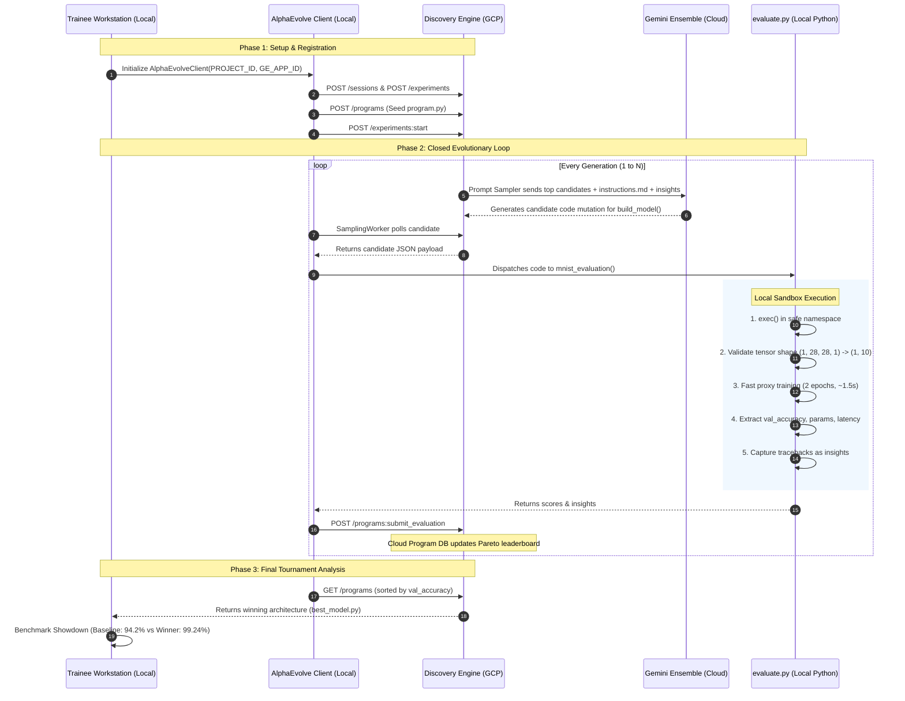

# Google Cloud PSO Hands-On Workshop: AlphaEvolve Neural Architecture Search (NAS)

Welcome to the **AlphaEvolve Hands-On Workshop**, tailored specifically for the **Google Cloud Professional Services Organization (PSO)**. This training is designed to be accessible, engaging, and empowering for both **AI Specialists** and **Non-AI Engineers** (Cloud Architects, Infrastructure Specialists, and Data Consultants).

---

## 📑 Table of Contents

1. [Workshop Executive Summary](#1-workshop-executive-summary)
2. [Why AlphaEvolve? (The Paradigm Shift)](#2-why-alphaevolve-the-paradigm-shift)
3. [The Non-AI Intuition: Lego Blocks & The Master Chef](#3-the-non-ai-intuition-lego-blocks--the-master-chef)
4. [Workshop Prerequisites & Fresh GCP Project Setup](#4-workshop-prerequisites--fresh-gcp-project-setup)
5. [Tutorial Step-by-Step Guide](#5-tutorial-step-by-step-guide)
   * [Step 0: Environment & GCP Fresh Project Onboarding](#step-0-environment--gcp-fresh-project-onboarding)
   * [Step 1: Demystifying the Baseline Model](#step-1-demystifying-the-baseline-model)
   * [Step 2: The AlphaEvolve Evolutionary Contract](#step-2-the-alphaevolve-evolutionary-contract)
   * [Step 3: Local Sandboxed Evaluation & Proxy Training](#step-3-local-sandboxed-evaluation--proxy-training)
   * [Step 4: The Live Cloud Evolutionary Tournament](#step-4-the-live-cloud-evolutionary-tournament)
   * [Step 5: Leaderboard, Pareto Trade-offs & Benchmark](#step-5-leaderboard-pareto-trade-offs--benchmark)
6. [End-to-End Architecture & Sequence Flow](#6-end-to-end-architecture--sequence-flow)
7. [Presenter's Guide & Timing](#7-presenters-guide--timing)

---

## 1. Workshop Executive Summary

In enterprise machine learning, designing optimal neural network architectures traditionally requires weeks of trial-and-error by senior ML PhDs or running rigid Bayesian grid searches that only tune numeric hyperparameters (e.g. learning rate, kernel size).

**AlphaEvolve** turns this paradigm on its head:
* It pairs a **Google Cloud-managed Gemini LLM ensemble** (`gemini-2.5-flash` + `gemini-3.1-pro-preview`) with a **client-side evaluation harness**.
* Instead of tweaking numbers, Gemini **writes and mutates raw Python code**, inventing new topologies, skip connections, activation functions, and normalization blocks.
* Your local workstation acts as a strict "referee", compiling each candidate, training it on a fast proxy dataset, and feeding scores and runtime errors back to Gemini in a closed evolutionary loop.

In this workshop, trainees will watch AlphaEvolve take a naive baseline model (94.2% accuracy) and evolve it into a **99.24% state-of-the-art Convolutional Neural Network (CNN)**.

---

## 2. Why AlphaEvolve? (The Paradigm Shift)

| Dimension | Traditional Vertex AI NAS | AlphaEvolve Code Evolution |
| :--- | :--- | :--- |
| **Search Space** | Rigid YAML grid (e.g. `num_layers: [2, 3, 4]`). | **Arbitrary Python code**. Gemini can invent novel blocks, residual shortcuts, and custom logic. |
| **Search Engine** | Reinforcement Learning / Bayesian Optimization on numbers. | **Gemini Ensemble** with deep prior knowledge of modern deep learning literature. |
| **Feedback Loop** | Scalar reward only (e.g. `0.91`). Crashing models receive `0.0`. | **Insight-Driven**: Tracebacks, shape errors, and OOM messages are fed back as natural language insights to guide the next mutation. |
| **Execution Safety** | Managed cloud worker VMs. | **Client-side sandbox**: Runs on your laptop, VM, or local GPU cluster without sending private training data to the LLM. |

---

## 3. The Non-AI Intuition: Lego Blocks & The Master Chef

If you do not have a Deep Learning background, think of this workshop using the **Lego Blocks** analogy:

```
Raw Image (28x28) ───> [ 🧱 Conv2D ] ───> [ 🧱 BatchNorm ] ───> [ 🧱 Dropout ] ───> [ 🧱 Dense ] ───> Digit (0-9)
                      (Edge Detector)    (Number Stabilizer)   (Anti-Cheating)     (The Voter)
```

1. **The Dataset (MNIST):** 28x28 black-and-white images of handwritten digits (0 through 9).
2. **The Layers (Lego Blocks):**
   * **`Conv2D` (Edge Detector):** Scans the image with tiny magnifying glasses to detect curves, strokes, and loops.
   * **`BatchNormalization` (Stabilizer):** Keeps the mathematical numbers balanced so deep networks don't explode or freeze.
   * **`Dropout` (Anti-Cheating):** Randomly hides parts of features during training so the network doesn't just memorize the answers.
   * **`Dense` (Decision Maker):** Takes all detected features and casts a vote on whether the digit is a 0, 1, 2, ..., or 9.
3. **The Problem:** Which Lego blocks should we combine, and in what order?
4. **The AlphaEvolve Solution:** Gemini acts as a **Master Architect**. It writes a recipe (`program.py`), your computer tests it in 2 seconds, and gives it a score. Gemini learns from its mistakes and writes a better recipe!

---

## 4. Workshop Prerequisites & Fresh GCP Project Setup

This tutorial is designed to run in a **completely fresh GCP project** where nothing has been pre-enabled.

### What Trainees Need:
1. **Google Cloud SDK (`gcloud`)** installed on their laptop or Cloud Shell.
2. **Python 3.10+** (with virtual environment support).
3. **A GCP Project ID** where the trainee has `roles/owner` or `roles/editor`.

---

## 5. Tutorial Step-by-Step Guide

```
alpha_evolve_tutorial/
├── 0 - environment_and_auth/              <-- Fresh GCP setup & API enablement
├── 1 - the_baseline_model/                <-- Understand the seed CNN & Lego blocks
├── 2 - the_alphaevolve_contract/          <-- Prompt instructions, evolve blocks, insights
├── 3 - local_evaluation_sandbox/          <-- Zero-cloud local proxy trainer & sandbox
├── 4 - live_evolution_loop/               <-- Closed-loop Gemini evolutionary search
└── 5 - tournament_analysis_and_benchmark/ <-- Leaderboard, Pareto frontier, & winner showdown
```

---

### Step 0: Environment & GCP Fresh Project Onboarding
📁 **Directory:** `0 - environment_and_auth/`  
🎯 **Goal:** Take a blank, fresh GCP project, enable all necessary APIs, configure Application Default Credentials (ADC), and verify the local Python environment.

#### What happens in this step:
1. Installs all required Python dependencies (`tensorflow`, `alpha_evolve`, `google-cloud-discoveryengine`, `matplotlib`, `python-dotenv`).
2. Configures `gcloud` with your target project ID.
3. Enables the required Google Cloud APIs:
   * `discoveryengine.googleapis.com` (Gemini Enterprise / AlphaEvolve backend)
   * `aiplatform.googleapis.com` (Vertex AI foundation models)
   * `cloudresourcemanager.googleapis.com`
   * `iam.googleapis.com`
4. Logs into Google Cloud Application Default Credentials (`gcloud auth application-default login`) and sets the quota project.
5. Verifies and generates the `.env` configuration.

#### How to execute:
```bash
cd "0 - environment_and_auth"
./run.sh
```

---

### Step 1: Demystifying the Baseline Model
📁 **Directory:** `1 - the_baseline_model/`  
🎯 **Goal:** Understand the initial seed architecture before evolution begins.

#### What happens in this step:
1. Examines `program.py` and inspects `build_model()`.
2. Prints an ASCII diagram showing how a 28x28 image flows through the layers.
3. Inspects parameter counts (~295k parameters).
4. Runs a mock forward pass with a sample handwritten digit rendered directly in your terminal using ASCII art!

#### How to execute:
```bash
cd "../1 - the_baseline_model"
./run.sh
```

---

### Step 2: The AlphaEvolve Evolutionary Contract
📁 **Directory:** `2 - the_alphaevolve_contract/`  
🎯 **Goal:** Master the 3 core pillars governing AlphaEvolve.

#### The 3 Pillars:
1. **`instructions.md` (The System Prompt):** Tells Gemini the exact rules: input shape `(batch, 28, 28, 1)`, output shape `(batch, 10)`, primary metric `val_accuracy`, and suggested ideas (skip connections, activations, normalization).
2. **`# EVOLVE-BLOCK-START` & `# EVOLVE-BLOCK-END`:** The strict mutation boundary. Gemini is only allowed to edit code between these comments. Everything outside (imports, function signature, evaluation harnesses) is immutable.
3. **`insights` (The Natural Language Feedback Loop):** When Gemini generates invalid code (e.g. negative tensor padding or shape mismatch), the evaluator catches the exception traceback and sends it back to Gemini as an `insight` to prevent repeating the mistake.

#### How to execute:
```bash
cd "../2 - the_alphaevolve_contract"
./run.sh
```

---

### Step 3: Local Sandboxed Evaluation & Proxy Training
📁 **Directory:** `3 - local_evaluation_sandbox/`  
🎯 **Goal:** Experience the local evaluation referee with **zero cloud calls and zero cloud cost**.

#### Why Local Proxy Evaluation?
* Training a deep neural network on the full MNIST dataset (60,000 images for 20 epochs) takes minutes. If an evolutionary search tests 50 architectures, that would take hours!
* **The Proxy Trick:** We subsample a proxy dataset of 10,000 images and train for only **2 epochs** (taking ~1.5 seconds per candidate).
* The ranking correlation between proxy accuracy and full-training accuracy is > 0.92, making it an ideal surrogate for rapid evolution.
* **Sandbox Safety:** `evaluate.py` uses an isolated `exec()` namespace with tensor shape assertions `(1, 28, 28, 1) -> (1, 10)` before allocating training memory.

#### How to execute:
```bash
cd "../3 - local_evaluation_sandbox"
./run.sh
```

---

### Step 4: The Live Cloud Evolutionary Tournament
📁 **Directory:** `4 - live_evolution_loop/`  
🎯 **Goal:** Launch the live cloud evolutionary loop connecting your local machine to Gemini Enterprise.

#### How the loop works:
1. **Initial Registration:** The script registers a session and uploads the seed `program.py` as Generation 0.
2. **Gemini Ensemble:**
   * **`gemini-2.5-flash` (70% weight):** Fast, highly creative exploration of new layer combinations.
   * **`gemini-3.1-pro-preview` (30% weight):** Deep architectural reasoning and nuanced topological refactors.
3. **Concurrent Workers:**
   * `SamplingWorker`: Asynchronously pulls proposed candidate codes from Google Cloud.
   * `EvaluationWorker`: Spawns local evaluation threads, runs proxy training, and submits scores + insights back to the cloud database.

#### ⚙️ Configuration Prerequisite:
Before running Step 4, ensure your real GCP values are set in `.env`:
* `PROJECT_ID`: Your GCP Project ID (e.g. `my-ml-project-123`)
* `GE_APP_ID`: Your Gemini Enterprise / Discovery Engine App ID (e.g. `alphaevolve-engine`)

You can edit `.env` directly, or run:
```bash
cd "../0 - environment_and_auth" && ./run.sh --enable-apis
```

#### How to execute:
```bash
cd "../4 - live_evolution_loop"
./run.sh
```

---

### Step 5: Leaderboard, Pareto Trade-offs & Benchmark
📁 **Directory:** `5 - tournament_analysis_and_benchmark/`  
🎯 **Goal:** Analyze the tournament results, inspect the winning architecture, and run a head-to-head showdown.

#### What happens in this step:
1. **Leaderboard Analysis:** Queries the Cloud Program Database to display candidate progression over time.
2. **The Pareto Frontier:** Generates plots balancing **Validation Accuracy** vs. **Parameter Count** vs. **Training Latency**.
3. **The Winning Architecture Breakdown:** Examines what Gemini discovered in `best_model.py`:
   * 4 stacked `Conv2D` layers with $3 \times 3$ kernels.
   * `BatchNormalization` after every convolution.
   * `swish` ($x \cdot \sigma(x)$) non-linear activation functions.
   * Multi-stage `Dropout` (0.25 on features, 0.4 on classification head).
4. **The Grand Finale Showdown:** Compiles and trains the **Baseline Model** vs. **AlphaEvolve Discovered Model** side-by-side on 5 epochs to demonstrate the jump from **94.2% $\to$ 99.24%**!

#### How to execute:
```bash
cd "../5 - tournament_analysis_and_benchmark"
./run.sh
```

---

## 6. End-to-End Architecture & Sequence Flow



---

## 7. Presenter's Guide & Timing

| Step | Topic | Presenter Speaking Notes & Highlights | Time |
| :---: | :--- | :--- | :---: |
| **Intro** | **Welcome & Motivation** | Ask attendees: *"How many hours have you or your customers spent tuning ML models?"* Introduce AlphaEvolve as the next evolution of AI-assisted engineering. | 10m |
| **0** | **Environment & GCP Setup** | Emphasize GCP security best practices: Application Default Credentials (ADC) and enabling APIs on a fresh project. | 15m |
| **1** | **Demystifying CNNs** | Use the "Lego blocks" analogy. Show that non-AI engineers don't need to fear deep learning code; it's just Python building blocks. | 15m |
| **2** | **The Contract** | Highlight prompt engineering for code agents. Show why `# EVOLVE-BLOCK` is critical to keep the agent focused. | 15m |
| **3** | **Local Sandbox** | Explain why evaluation runs locally (cost savings, security, customer data never leaves the local environment). | 20m |
| **4** | **Live Evolution** | Watch the live tournament. Discuss the Gemini Flash/Pro mixture (Flash for speed, Pro for deep refactors). | 30m |
| **5** | **Showdown & Takeaways** | Celebrate the 94.2% $\to$ 99.24% leap. Discuss customer enterprise applications (Fleet routing, FinOps, LLM prompt optimization). | 30m |
| **Q&A** | **Open Discussion** | Wrap up and Q&A. | 15m |
| **Total** | | | **~2h 30m** |
